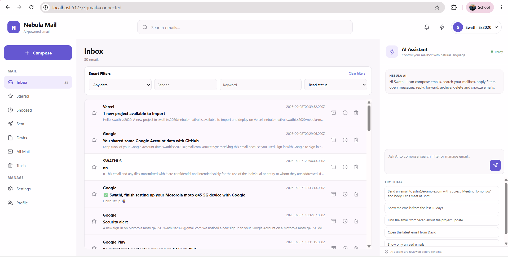
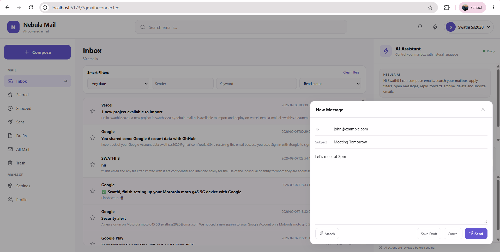
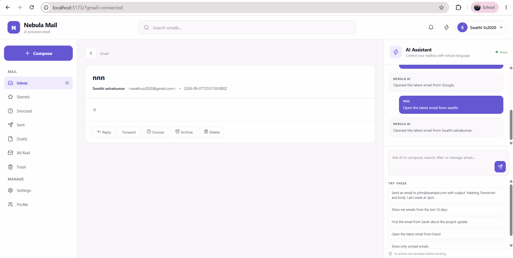
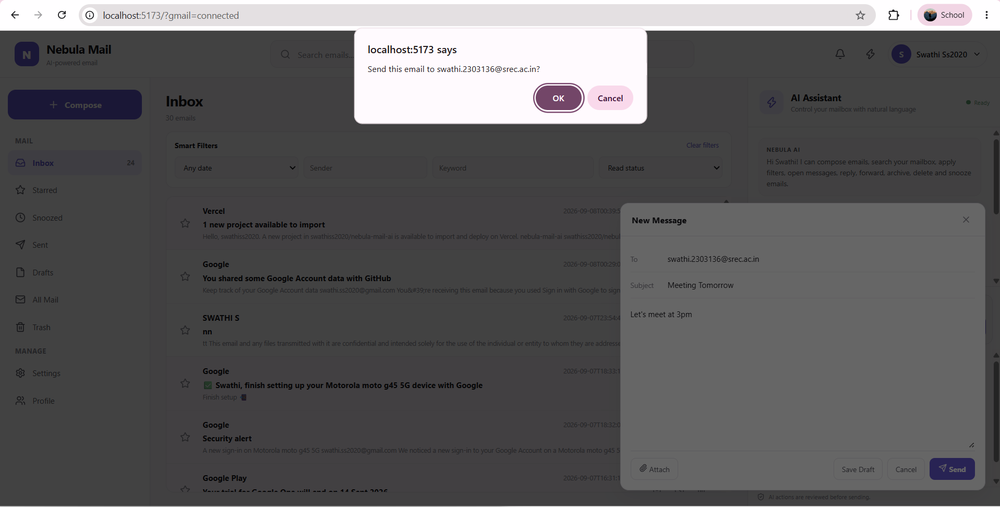
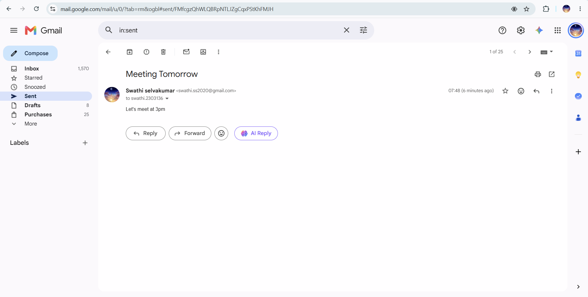

# Nebula Mail AI

An AI-powered Gmail web application that combines a functional email client with a natural-language assistant for controlling mailbox actions through the user interface.

Nebula Mail AI is designed around a simple idea:

> The AI assistant should control the application, not simply chat with the user.

Users can interact with their real Gmail account, browse emails, search and filter messages, compose emails, manage drafts, reply or forward messages, and use natural-language commands to control the mailbox interface.

---

## ✨ Features

### 📧 Gmail Integration

- Google OAuth authentication
- Real Gmail account connection
- Gmail Inbox
- Sent Mail
- Individual email detail view
- Read / unread email management
- Gmail profile information
- Real email sending through Gmail API

### ✍️ Compose & Email Actions

- Compose new emails
- Recipient, subject and message fields
- Send real emails through Gmail
- Save emails as drafts
- Load and manage drafts
- Reply to emails
- Forward emails
- File attachments
- Confirmation before sending

### 🔎 Search & Filtering

Users can search and filter their mailbox using the application UI and natural-language commands.

Supported concepts include:

- Keyword search
- Sender search
- Date filtering
- Read / unread filtering
- Mailbox navigation
- Clearing active searches and filters

### 🤖 AI Assistant

The AI assistant provides natural-language control of the mailbox UI.

Examples:

- "Go to inbox"
- "Show unread emails"
- "Search for project emails"
- "Find emails from Swathi"
- "Open the latest email from Swathi"
- "Compose an email to John"
- "Write an email to John saying the meeting is postponed"

The assistant interprets the user's request and performs the corresponding application action.

### 🎨 User Interface

- Modern responsive interface
- Inbox and Sent navigation
- Email preview cards
- Email detail view
- Compose interface
- AI Assistant panel
- Dark / light interface support
- Clear mailbox states and controls

---

# 🎯 Project Objective

Traditional email applications require users to manually navigate through different screens, search for messages, open emails, fill forms and perform actions.

Nebula Mail AI adds a natural-language interaction layer on top of a real Gmail client.

Instead of relying only on buttons and menus, users can communicate their intent using simple commands.

For example:

"Show unread emails from Swathi"

The application interprets the request and updates the mailbox accordingly.

Similarly:

"Compose an email to John saying I will attend the meeting"

can open the compose interface and populate the relevant fields.

The goal is to make common email workflows faster and more intuitive while keeping the actual Gmail operations visible to the user.

---

# 🧠 AI Assistant

The AI Assistant is a core interaction layer of the application.

It is not designed only as a chatbot that responds with text.

Instead, supported natural-language requests are interpreted as application actions.

## AI Interaction Flow

User
  |
  | Natural-language command
  v
AI Assistant
  |
  | Intent / command interpretation
  v
Application Action
  |
  +-- Navigate
  +-- Search
  +-- Filter
  +-- Open Email
  +-- Compose
  +-- Mark Read / Unread
  +-- Clear Filters
  |
  v
Updated Application UI

This approach allows the assistant to directly influence the state of the mailbox interface.

---

# 💬 Example AI Commands

| User Command | Result |
|---|---|
| Go to inbox | Opens Inbox |
| Go to sent mail | Opens Sent Mail |
| Show unread emails | Displays unread messages |
| Search for project | Searches mailbox for the keyword |
| Find emails from Swathi | Filters messages by sender |
| Clear search | Removes active search |
| Open the latest email from Swathi | Opens the matching email |
| Mark this email as read | Marks the selected email as read |
| Mark this email as unread | Marks the selected email as unread |
| Compose an email to John | Opens compose interface |
| Write an email to John saying the meeting is postponed | Opens compose and fills the email content |

---

# 📬 Gmail Workflow

The application works with a real Gmail account rather than a simulated mailbox.

Google OAuth
     |
     v
Connected Gmail Account
     |
     v
Gmail API
     |
     +-- Inbox
     +-- Sent
     +-- Messages
     +-- Drafts
     +-- Send Email

Emails sent from Nebula Mail AI are delivered through the connected Gmail account.

---

# ✉️ Compose & Send Workflow

The compose system supports:

- Recipient
- Subject
- Message body
- Attachments
- Save Draft
- Send
- Reply
- Forward

## Send Safety

Before sending an email through Gmail, the application asks the user to confirm the action.

Compose Email
      |
      v
Click Send
      |
      v
Confirmation
      |
      v
Gmail API
      |
      v
Email Sent

This reduces the risk of accidental email delivery.

---

# 🔎 Search & Filtering

Mailbox search and filtering can be performed through the application interface and assistant.

Examples:

- Search for project
- Find emails from Swathi
- Show unread emails
- Show emails containing meeting

The resulting mailbox state is reflected directly in the main UI.

---

# 🏗️ System Architecture

                    +----------------------+
                    |        User          |
                    | Natural Language     |
                    +----------+-----------+
                               |
                               v
                    +----------------------+
                    |    React Frontend    |
                    |                      |
                    |  Mailbox UI          |
                    |  AI Assistant        |
                    |  Compose             |
                    |  Search / Filters    |
                    |  Email Detail        |
                    +----------+-----------+
                               |
                         HTTP / API
                               |
                               v
                    +----------------------+
                    |   Express Backend    |
                    |                      |
                    |  OAuth               |
                    |  Gmail API           |
                    |  Send Email          |
                    |  Drafts              |
                    |  Messages            |
                    +----------+-----------+
                               |
                               v
                    +----------------------+
                    |       Gmail API      |
                    |    Google Account    |
                    +----------------------+

---

# 🛠️ Technology Stack

## Frontend

- React
- Vite
- JavaScript
- CSS

## Backend

- Node.js
- Express.js

## APIs & Authentication

- Gmail API
- Google OAuth 2.0

## Development Tools

- Git
- GitHub
- Visual Studio Code
- Google Chrome

---

# 📁 Project Structure

nebula-mail-ai/
|
+-- public/
|
+-- server/
|   +-- index.cjs
|
+-- src/
|   +-- App.jsx
|   +-- main.jsx
|   +-- ...
|
+-- .env.example
+-- .gitignore
+-- package.json
+-- package-lock.json
+-- README.md

---

# 🧩 Architecture Decisions & Trade-offs

## 1. React + Vite

React was selected because the application contains many interactive UI states such as:

- Mailbox navigation
- Search
- Filters
- Email detail
- Compose
- Drafts
- AI Assistant

Vite provides a fast and lightweight development environment.

## 2. Express Backend

The Express backend provides a controlled server-side layer between the frontend and Gmail.

This keeps OAuth credentials and Gmail API communication outside the browser's client-side code.

## 3. Gmail API

A real Gmail integration was selected instead of creating a mock email database.

This allows the application to perform meaningful real-world operations such as:

- Reading Gmail messages
- Accessing Inbox and Sent Mail
- Managing drafts
- Sending emails
- Working with the user's actual mailbox

## 4. Natural-Language Command Interpretation

For the current prototype, the assistant uses a lightweight command interpretation approach for supported mailbox commands.

This was chosen because it provides:

- Predictable behavior
- Fast implementation
- Low infrastructure complexity
- Easy validation of core mailbox actions
- Reliable control over important UI operations

A future version can extend this architecture with an LLM-based tool-calling system.

---

# 🔐 Security

Sensitive credentials are stored in environment variables rather than committed to source control.

The application uses configuration such as:

GOOGLE_CLIENT_ID=your_google_client_id
GOOGLE_CLIENT_SECRET=your_google_client_secret
GOOGLE_REDIRECT_URI=http://127.0.0.1:3001/auth/google/callback
SESSION_SECRET=your_session_secret

The real .env file is excluded from Git using .gitignore.

Only .env.example is included in the repository.

Never commit real OAuth credentials, client secrets or session secrets to GitHub.

---

# 🚀 Running Locally

## Prerequisites

Install:

- Node.js
- npm
- Git

Check the installed versions:

node --version
npm --version
git --version

---

## 1. Clone the Repository

git clone https://github.com/swathiss2020/nebula-mail-ai.git

Enter the project:

cd nebula-mail-ai

---

## 2. Install Dependencies

npm install

---

## 3. Configure Environment Variables

Create a .env file in the project root.

Use the following structure:

GOOGLE_CLIENT_ID=your_google_client_id
GOOGLE_CLIENT_SECRET=your_google_client_secret
GOOGLE_REDIRECT_URI=http://127.0.0.1:3001/auth/google/callback
SESSION_SECRET=your_session_secret

Replace the placeholder values with the credentials from your Google Cloud project.

---

## 4. Start the Backend

Open a terminal and run:

node server/index.cjs

The backend runs on:

http://127.0.0.1:3001

---

## 5. Start the Frontend

Open a second terminal and run:

npm run dev

The frontend will normally be available at:

http://localhost:5173

Open the URL in your browser.

---

# 🔑 Google OAuth Configuration

To connect a Gmail account:

1. Create or select a Google Cloud project.
2. Enable the Gmail API.
3. Configure the OAuth consent screen.
4. Create OAuth 2.0 credentials.
5. Configure the required redirect URI.
6. Add permitted test users when using OAuth Testing mode.
7. Copy the client ID and client secret into .env.
8. Start the application.
9. Connect the Gmail account through the application.

---

# 🧪 Application Testing

After starting the application, the following workflows can be tested.

## Authentication

Open Application
       |
       v
Connect Gmail
       |
       v
Google Authentication
       |
       v
Mailbox Loaded

## Inbox

Verify:

- Inbox messages appear.
- Email previews are displayed.
- An email can be opened.
- Read/unread state works.

## Sent Mail

Verify:

- Sent Mail can be opened.
- Sent messages are displayed.

## Search

Try:

project

and verify that matching messages are displayed.

## AI Assistant

Try:

Go to inbox

Show unread emails

Search for project

Compose an email

## Sending

1. Open Compose.
2. Enter the recipient.
3. Enter subject.
4. Enter the message.
5. Click Send.
6. Confirm the send action.
7. Verify that the email is delivered through Gmail.
8. Verify it appears in Sent Mail.

---

# 📸 Demo & Screenshots

The following screenshots demonstrate the major AI-assisted workflows implemented in Nebula Mail AI.

## Screenshot 1 — Main Mailbox

The main interface shows the connected Gmail mailbox, Inbox, email list, navigation, and AI Assistant.

---

## Screenshot 2 — AI-Powered Compose

The AI Assistant interprets a natural-language command and opens the Compose interface with the email fields populated.

---

## Screenshot 3 — AI Email Navigation

The assistant understands a natural-language request to locate and open a specific email from the mailbox.

---

## Screenshot 4 — Send Confirmation

Before an email is sent through the real Gmail account, the application displays a confirmation step to prevent accidental sending.

---

## Screenshot 5 — Real Gmail Result

The email sent through the application can be verified directly in the authenticated Gmail account's Sent Mail.

---

# 📈 Future Improvements

With additional development time, the following improvements could be added.

## 1. Real-Time Gmail Synchronization

Implement Gmail push notifications and history synchronization so mailbox changes can be reflected immediately without requiring manual refresh.

## 2. LLM-Based Tool Calling

The current command interpretation layer can be extended into a true LLM-powered tool-calling architecture.

Example:

User
  |
  v
LLM Agent
  |
  +-- searchEmails()
  +-- openEmail()
  +-- composeEmail()
  +-- markAsRead()
  +-- markAsUnread()
  +-- sendEmail()
  |
  v
Application UI

This would allow the assistant to handle more flexible natural-language requests.

## 3. Rich AI UI Rendering

The assistant could render interactive email cards directly inside the assistant panel.

Example:

+----------------------------------+
| From: John                       |
| Subject: Project Meeting         |
| Preview: Let's meet tomorrow...  |
|                                  |
| [Open]       [Reply]             |
+----------------------------------+

## 4. Threaded Conversations

Group related Gmail messages into conversation threads for easier reading and navigation.

## 5. Improved Context Awareness

The assistant could maintain stronger awareness of the currently opened email.

Example:

User:
Reply to this saying I will attend.

Assistant:
Understands "this" as the currently opened email.

## 6. Automated Testing

Add automated tests for:

- Gmail authentication
- Search
- Filtering
- Compose
- Sending
- Draft management
- AI command interpretation
- Gmail API operations

Possible tools include:

- Vitest
- Jest
- React Testing Library

## 7. Production Deployment

Deploy the frontend and backend to a production environment so evaluators can access the application using a live URL instead of running it locally.

---

# 🎓 Engineering Approach

The project follows a pragmatic engineering approach focused on delivering the most important user workflows within the available development time.

The primary workflow is:

Authenticate
     |
     v
View Mail
     |
     v
Search / Filter
     |
     v
Open Email
     |
     v
Compose
     |
     v
Confirm
     |
     v
Send

The AI assistant is placed on top of these existing workflows so that natural-language commands can control the same application state and UI that a user would normally control manually.

---

# 🌟 Key Takeaway

Nebula Mail AI demonstrates how natural-language interaction can be integrated into a real productivity application.

Instead of treating AI as a separate chatbot, the project uses the assistant as an interaction layer for the email client.

The user can express an intention in natural language, and the application translates that intention into a visible mailbox action.

This creates a more intuitive workflow while retaining the functionality of a real Gmail client.

---

# 📌 Current Status

The current application includes:

- ✅ Google OAuth authentication
- ✅ Real Gmail account connection
- ✅ Gmail Inbox
- ✅ Sent Mail
- ✅ Email detail view
- ✅ Real Gmail email sending
- ✅ Send confirmation
- ✅ Draft management
- ✅ Reply and Forward
- ✅ File attachments
- ✅ Search
- ✅ Email filtering
- ✅ Read / unread actions
- ✅ Natural-language AI assistant
- ✅ AI-assisted mailbox navigation
- ✅ AI-assisted compose workflow
- ✅ Dark / light interface
- ✅ GitHub repository
- ✅ Environment secrets excluded from Git

Planned improvements include:

- Real-time Gmail push synchronization
- LLM-based tool calling
- Rich assistant UI rendering
- Stronger context awareness
- Automated tests
- Production deployment

---

# 👩‍💻 Author

## Swathi S

AI-Powered Mail Web Application

Built as part of the Nebula KnowLab project-based hiring selection.

---

## 📄 License

This project was developed as a project-based hiring assignment and is maintained as a private repository.